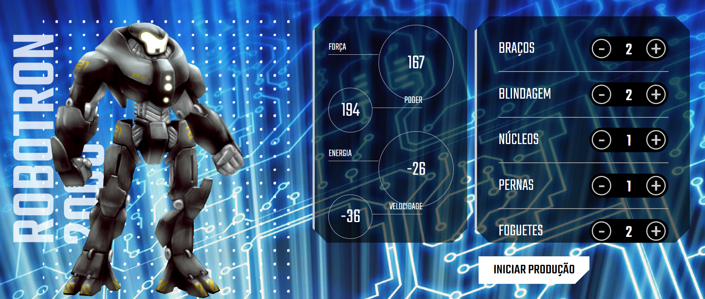

# Robotron

Bem-vindo ao Robotron 2000, um aplicativo web para construir e personalizar seu próprio robô com diferentes componentes e ver suas estatísticas!

  

## Sumário

- [Tecnologias Utilizadas](#tecnologias-utilizadas)
- [Status](#status)
- [Descrição](#descrição)
- [Funcionalidades](#funcionalidades)
- [Como Usar](#como-usar)
- [Estrutura do Projeto](#estrutura-do-projeto)
- [Observações](#Observações)
- [Autor](#autor)

## Tecnologias Utilizadas

  

    
  

  

    
  

  

    
  

## Status

<!--  -->

## Descrição

O código em main.js e HTML constitui o Robotron 2000, um aplicativo de montagem de robôs interativo. 

Os usuários podem personalizar seus robôs ajustando a quantidade de diferentes peças, como braços, blindagem, núcleos, pernas e foguetes. Ao clicar nos botões de controle no HTML, as estatísticas do robô são dinamicamente recalculadas, proporcionando uma visualização em tempo real do impacto das escolhas de peças na força, poder, energia e velocidade do robô. 

Em essência, o projeto oferece uma experiência envolvente de montagem e visualização das características do robô resultante.

## Funcionalidades

O código permite ajustar a quantidade de cada tipo de peça (braços, blindagem, núcleos, pernas, foguetes) através de botões de controle. Ao fazer esses ajustes, as estatísticas do robô são atualizadas dinamicamente.

## Como Usar

No HTML, as peças têm botões de controle (- e +) para ajustar a quantidade desejada. Ao clicar nos botões, as estatísticas do robô são atualizadas em tempo real.

## Estrutura do Projeto

O projeto possui uma estrutura simples, com um arquivo main.js responsável pela manipulação dos dados e uma página HTML que contém a interface do usuário. As estatísticas do robô são exibidas e atualizadas conforme as interações do usuário.

## Autor

Desenvolvido por Diego Franco.
